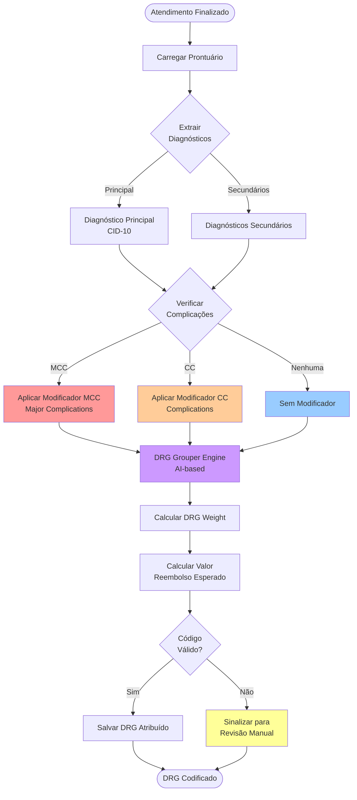
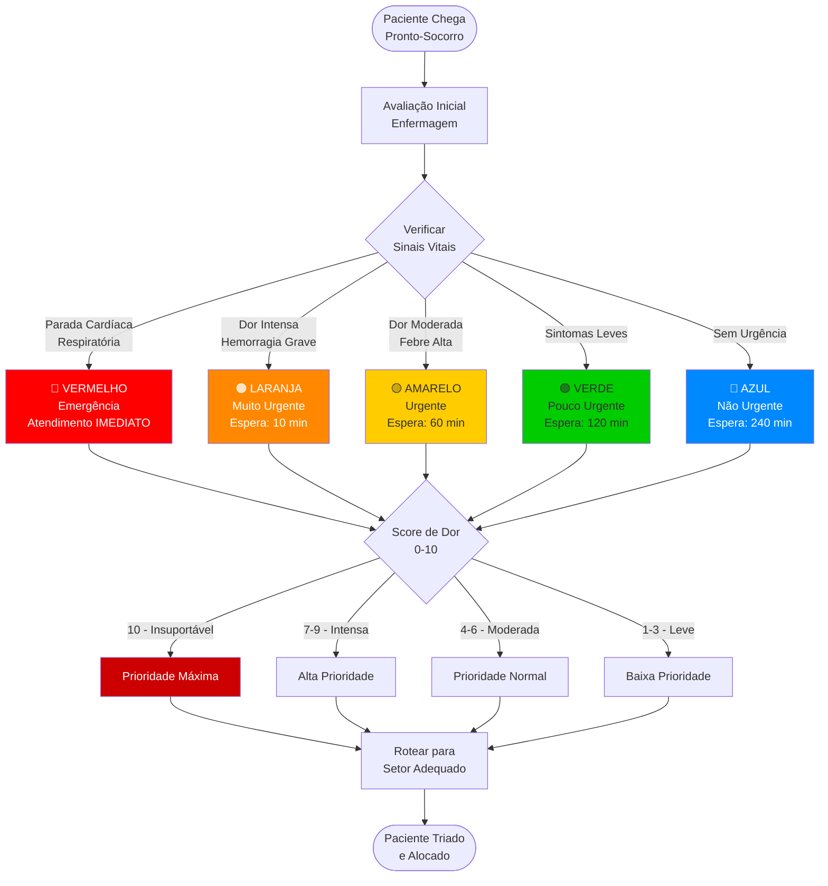
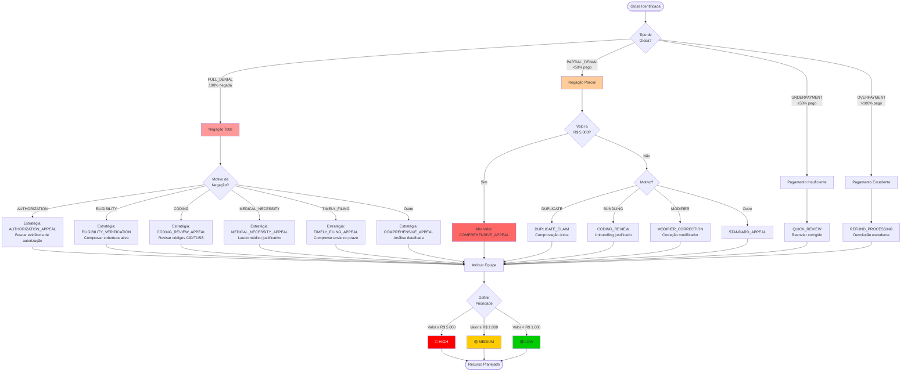
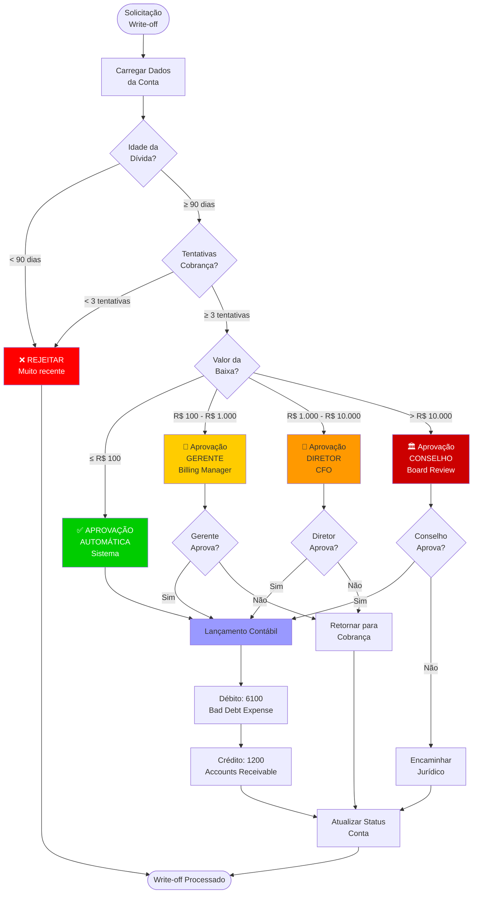
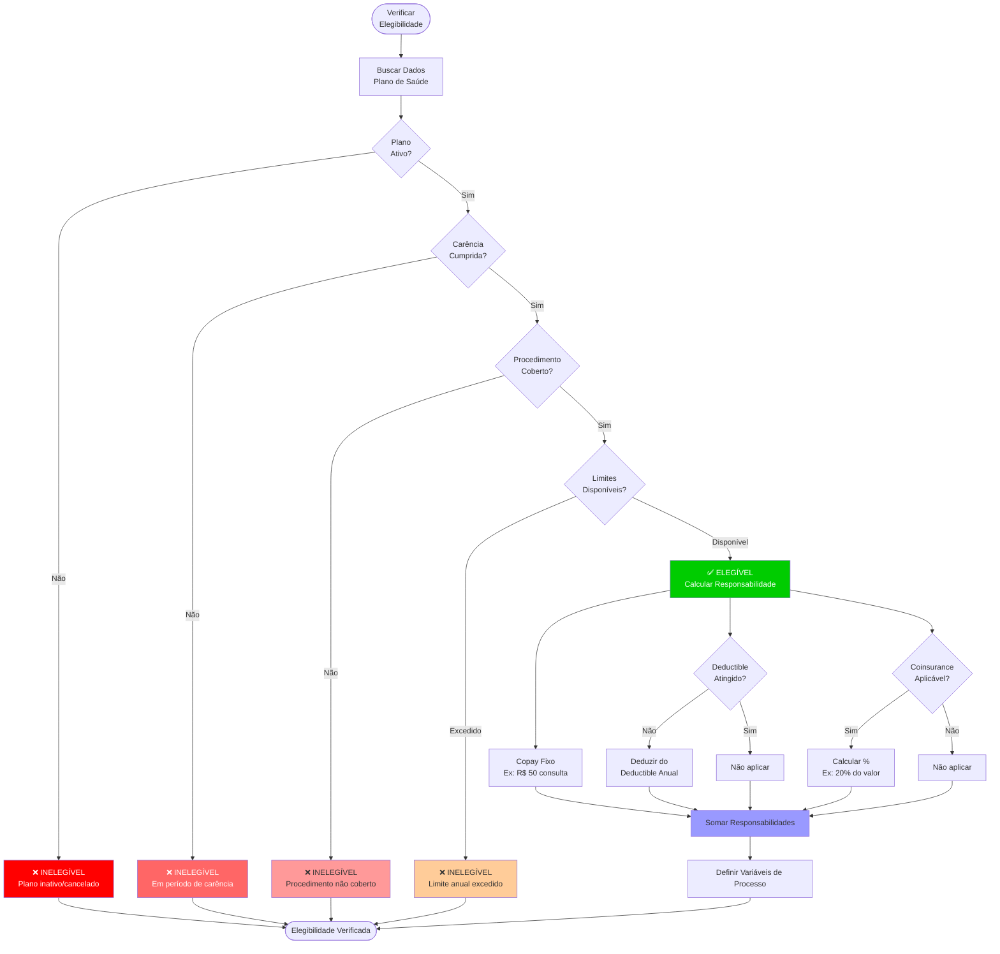
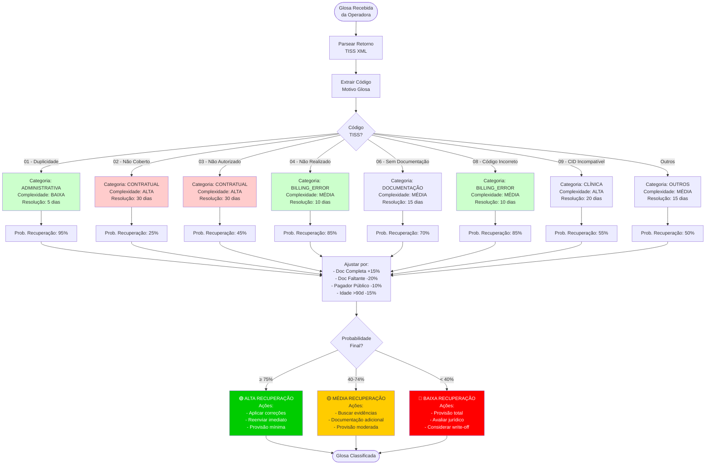
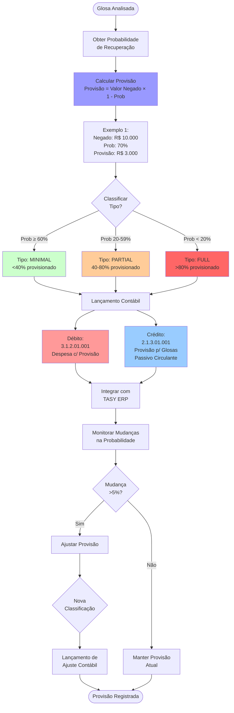
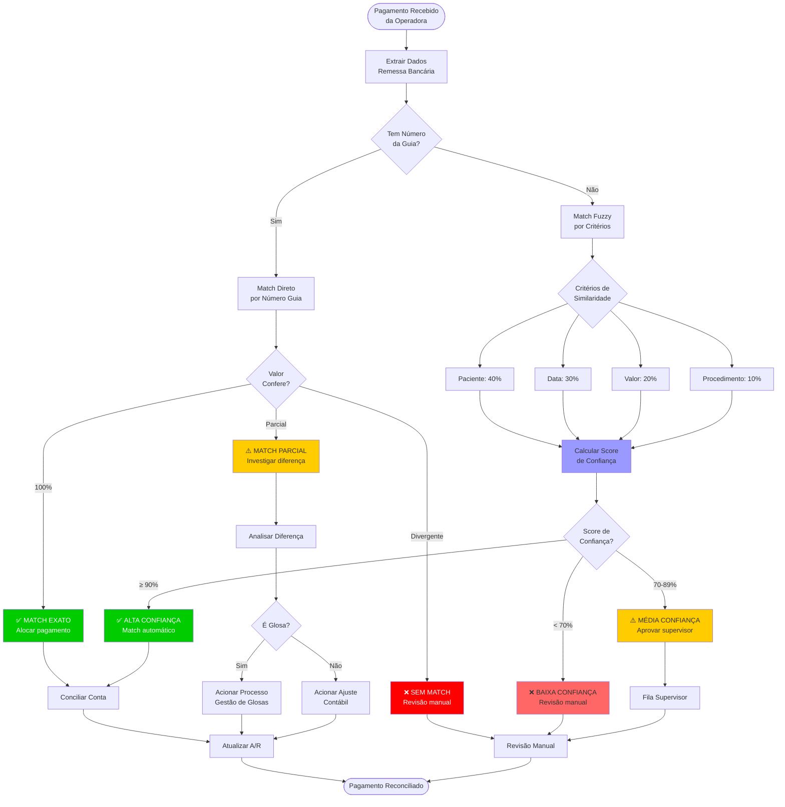

# Fluxos de Decisão - Regras de Negócio (PT-BR)

**Domínio**: Ciclo de Receita Hospitalar
**Metodologia**: SPARC + Hive Mind Swarm
**Data**: 2026-01-11
**Idioma**: Português Brasileiro

---

## 📊 ÍNDICE DE DIAGRAMAS

1. [DRG Grouper - Codificação Inteligente](#drg-grouper-logic)
2. [Protocolo de Triagem Manchester](#manchester-triage-protocol)
3. [Estratégia de Recurso de Glosa](#glosa-appeal-strategy)
4. [Fluxo de Aprovação de Write-off](#write-off-approval-workflow)
5. [Verificação de Elegibilidade do Paciente](#patient-eligibility-verification)
6. [Análise de Glosas - Roteamento](#glosa-analysis-routing)
7. [Provisionamento Financeiro](#financial-provision-flow)
8. [Reconciliação de Pagamentos](#payment-matching-flow)

---

## 1. DRG Grouper - Codificação Inteligente {#drg-grouper-logic}

**Arquivo Fonte**: `AIDRGCodingDelegate.java`
**Descrição**: Fluxo de decisão para atribuição automática de DRG (Diagnosis Related Group) usando inteligência artificial



**Regras de Negócio**:
- **RN-DRG-001**: Diagnóstico principal determina MDC (Major Diagnostic Category)
- **RN-DRG-002**: MCC aumenta DRG weight em média 30-40%
- **RN-DRG-003**: CC aumenta DRG weight em média 15-20%
- **RN-DRG-004**: Modelo IA sugere DRG com score de confiança >85%
- **RN-DRG-005**: Score <85% → roteamento para codificador humano

---

## 2. Protocolo de Triagem Manchester {#manchester-triage-protocol}

**Arquivo Fonte**: `RegistrarTriagemDelegate.java`
**Descrição**: Classificação de risco do paciente no pronto-socorro usando Protocolo de Manchester



**Regras de Negócio**:
- **RN-TRIAGEM-001**: VERMELHO → Atendimento imediato (tempo: 0 min)
- **RN-TRIAGEM-002**: LARANJA → Atendimento em até 10 minutos
- **RN-TRIAGEM-003**: AMARELO → Atendimento em até 60 minutos
- **RN-TRIAGEM-004**: VERDE → Atendimento em até 120 minutos
- **RN-TRIAGEM-005**: AZUL → Atendimento em até 240 minutos
- **RN-TRIAGEM-006**: Score de dor ≥8 → escalar 1 nível de prioridade
- **RN-TRIAGEM-007**: Reclassificação automática a cada 30 minutos se não atendido

---

## 3. Estratégia de Recurso de Glosa {#glosa-appeal-strategy}

**Arquivo Fonte**: `AnalyzeGlosaDelegate.java`
**Descrição**: Seleção automatizada da estratégia de recurso baseada no tipo e motivo da glosa



**Regras de Negócio**:
- **RN-GLOSA-STR-001**: FULL_DENIAL + AUTHORIZATION → AUTHORIZATION_APPEAL
- **RN-GLOSA-STR-002**: PARTIAL_DENIAL + Valor ≥ R$ 5.000 → COMPREHENSIVE_APPEAL
- **RN-GLOSA-STR-003**: Prioridade HIGH se valor ≥ R$ 5.000 OU (FULL_DENIAL E valor ≥ R$ 1.000)
- **RN-GLOSA-STR-004**: Equipes especializadas por estratégia (ver mapeamento completo)

---

## 4. Fluxo de Aprovação de Write-off {#write-off-approval-workflow}

**Arquivo Fonte**: `WriteOffDelegate.java`
**Descrição**: Workflow multi-nível para aprovação de baixa de créditos incobráveis



**Regras de Negócio**:
- **RN-WRITEOFF-001**: Valor ≤ R$ 100 → aprovação automática
- **RN-WRITEOFF-002**: R$ 100 < Valor ≤ R$ 1.000 → aprovação gerente
- **RN-WRITEOFF-003**: R$ 1.000 < Valor ≤ R$ 10.000 → aprovação diretor
- **RN-WRITEOFF-004**: Valor > R$ 10.000 → aprovação conselho
- **RN-WRITEOFF-005**: Pré-requisitos obrigatórios:
  - Idade da dívida ≥ 90 dias
  - Mínimo 3 tentativas de cobrança documentadas
  - Paciente notificado formalmente
- **RN-WRITEOFF-006**: Lançamento contábil:
  - Débito: 6100 (Bad Debt Expense)
  - Crédito: 1200 (Accounts Receivable)

---

## 5. Verificação de Elegibilidade do Paciente {#patient-eligibility-verification}

**Arquivo Fonte**: `VerifyPatientEligibilityDelegate.java`
**Descrição**: Cálculo da responsabilidade financeira do paciente (copay, deductible, coinsurance)



**Fórmulas de Cálculo**:

```
Patient Responsibility = Copay + Deductible Aplicável + Coinsurance

Onde:
- Copay = Valor fixo por procedimento (ex: R$ 50)
- Deductible Aplicável = MIN(Procedimento Custo, Deductible Restante Anual)
- Coinsurance = (Procedimento Custo - Deductible Aplicável) × Coinsurance %
```

**Regras de Negócio**:
- **RN-ELIG-001**: Plano deve estar ativo (status = ACTIVE)
- **RN-ELIG-002**: Data atual > Data contrato + Período carência
- **RN-ELIG-003**: Procedimento deve constar no rol ANS contratado
- **RN-ELIG-004**: Limite anual não pode estar excedido
- **RN-ELIG-005**: Copay aplicado independentemente de outros custos
- **RN-ELIG-006**: Deductible anual acumulado durante o ano calendário
- **RN-ELIG-007**: Coinsurance aplicado apenas ao valor acima do deductible

---

## 6. Análise de Glosas - Roteamento por Código TISS {#glosa-analysis-routing}

**Arquivo Fonte**: `GlosaAnalysisService.java`
**Descrição**: Classificação e roteamento automático baseado em códigos TISS ANS



**Regras de Negócio**:
- **RN-TISS-ROUT-001**: Cada código TISS tem categoria, complexidade e SLA de resolução
- **RN-TISS-ROUT-002**: Probabilidade base é ajustada por fatores contextuais
- **RN-TISS-ROUT-003**: Alta probabilidade (≥75%) → reenvio imediato
- **RN-TISS-ROUT-004**: Baixa probabilidade (<40%) → provisão total
- **RN-TISS-ROUT-005**: Valor > R$ 100.000 + Prob <40% → encaminhamento jurídico

---

## 7. Provisionamento Financeiro de Glosas {#financial-provision-flow}

**Arquivo Fonte**: `FinancialProvisionService.java`
**Descrição**: Cálculo e lançamento contábil de provisão para glosas



**Fórmulas**:

```
Provisão = Valor Negado × (1 - Probabilidade Recuperação)

Classificação:
- MINIMAL: Prob ≥ 60% → Provisão < 40% do valor
- PARTIAL: 20% ≤ Prob < 60% → Provisão 40-80% do valor
- FULL: Prob < 20% → Provisão > 80% do valor

Threshold Atualização: |Nova Provisão - Provisão Atual| / Provisão Atual > 5%
```

**Regras de Negócio**:
- **RN-PROV-001**: Provisão arredondada HALF_UP com 2 decimais
- **RN-PROV-002**: Atualização apenas se mudança > 5%
- **RN-PROV-003**: Lançamentos seguem CPC (Normas Contábeis Brasileiras)
- **RN-PROV-004**: Reversão de provisão ao recuperar valor
- **RN-PROV-005**: Write-off move provisão para perda efetiva

---

## 8. Reconciliação Automática de Pagamentos {#payment-matching-flow}

**Arquivo Fonte**: `AutoMatchingDelegate.java`
**Descrição**: Algoritmo de matching automático entre pagamentos recebidos e guias enviadas



**Algoritmo de Matching**:

```
Score de Confiança = (
  Patient Match × 0.40 +
  Date Match × 0.30 +
  Amount Match × 0.20 +
  Procedure Match × 0.10
) × 100

Onde cada Match é:
- 1.0 (100%) para match exato
- 0.8-0.99 para match parcial (ex: valor com 5% diferença)
- 0.0 para sem match

Decisão:
- Score ≥ 90% → Match automático
- Score 70-89% → Aprovação supervisor
- Score < 70% → Revisão manual
```

**Regras de Negócio**:
- **RN-MATCH-001**: Match direto por número de guia tem prioridade
- **RN-MATCH-002**: Fuzzy match usa pesos: Paciente 40%, Data 30%, Valor 20%, Procedimento 10%
- **RN-MATCH-003**: Diferença < 1% considerada "match exato"
- **RN-MATCH-004**: Diferença 1-10% → aprovação supervisor
- **RN-MATCH-005**: Diferença > 10% → investigação de glosa
- **RN-MATCH-006**: Machine learning aprende padrões de matching bem-sucedidos

---

## 📌 NOTAS SOBRE DIAGRAMAS

### Convenções Mermaid Utilizadas:

- **Losango (`{}`)**: Gateway de decisão (XOR)
- **Retângulo (`[]`)**: Atividade/Task
- **Círculo (`()`)**: Evento Start/End
- **Cores**:
  - 🔴 Vermelho: Rejeição, alta criticidade
  - 🟡 Amarelo: Atenção, média prioridade
  - 🟢 Verde: Aprovação, sucesso
  - 🔵 Azul: Processamento contábil

### Ferramentas de Renderização:
- Mermaid Live Editor: https://mermaid.live
- VS Code Extension: Markdown Preview Mermaid Support
- GitHub/GitLab: Renderização nativa

---

## X. Conformidade Regulatória

### Regulamentações Aplicadas nos Fluxos

| Fluxo | Regulamentação | Descrição | Impacto |
|-------|----------------|-----------|---------|
| **DRG Grouper** | Portaria MS 2.848/2007 | Sistema de classificação DRG | RN-DRG-001 a RN-DRG-005 (agrupamento diagnóstico) |
| **Manchester Triage** | CFM Resolução 2148/2016 | Protocolo de classificação de risco | RN-TRIAGEM-001 a RN-TRIAGEM-007 (tempos máximos atendimento) |
| **Glosa Appeal** | RN 395/2016 ANS | Procedimentos de recurso de glosas | RN-GLOSA-STR-001 a RN-GLOSA-STR-004 (estratégias baseadas em motivo) |
| **Write-off Approval** | Lei 11.638/2007, SOX | Controles internos financeiros | RN-WRITEOFF-001 a RN-WRITEOFF-006 (aprovação escalonada) |
| **Patient Eligibility** | Lei 9.656/1998, RN 465/2021 ANS | Cobertura mínima obrigatória | RN-ELIG-001 a RN-ELIG-007 (carências e responsabilidade) |
| **TISS Routing** | RN 388/2015 ANS (TISS 4.01) | Códigos padronizados de glosa | RN-TISS-ROUT-001 a RN-TISS-ROUT-005 (classificação por código) |
| **Financial Provision** | CPC 25, NBC TG 25 | Provisionamento contábil | RN-PROV-001 a RN-PROV-005 (cálculo de provisão) |
| **Payment Matching** | RN 395/2016 ANS | Reconciliação de pagamentos | RN-MATCH-001 a RN-MATCH-006 (algoritmo fuzzy matching) |

### Requisitos de Auditoria

- **Rastreamento de Decisões**: Todos os gateways de decisão devem registrar justificativa em audit trail
- **Evidências de Conformidade**: Decisões baseadas em regulamentação ANS devem referenciar norma aplicável
- **Retenção de Logs**: 5 anos para decisões financeiras (SOX), 10 anos para decisões clínicas (CFM)
- **LGPD Art. 11**: Tratamento de dados sensíveis de saúde com finalidade de prestação de serviços

---

## XI. Notas de Migração

### Considerações para Migração de Diagramas

**De Mermaid para BPMN 2.0 Executável**:

1. **Gateways de Decisão**:
   - Mermaid `{}` → BPMN `<exclusiveGateway>`
   - Todos os gateways devem ter condition expressions em Groovy ou JUEL
   - Exemplo: `${amount >= 5000}` para threshold de valor

2. **Fluxos Condicionais**:
   - Mermaid setas rotuladas → BPMN `<sequenceFlow>` com `<conditionExpression>`
   - Garantir que todas as condições sejam mutuamente exclusivas
   - Definir fluxo default para casos não previstos

3. **Tarefas de Serviço**:
   - Retângulos Mermaid → BPMN `<serviceTask>` com delegate class
   - Exemplo: "Calcular Provisão" → `<serviceTask id="calcProvision" camunda:delegateExpression="${financialProvisionDelegate}"/>`

4. **Eventos de Erro**:
   - Caminhos de erro Mermaid → BPMN `<boundaryEvent type="error">`
   - Todos os delegates devem lançar `BpmnError` para erros de negócio

### Camunda 7 para Camunda 8

**Breaking Changes**:
- **DMN Integration**: Gateways complexos devem ser movidos para DMN Decision Tables
- **Timers**: Expressões de tempo devem usar ISO 8601 (ex: `PT10M` para 10 minutos)
- **Variáveis**: Transição de ObjectValue para JSON serialization
- **Events**: Camunda 8 usa Message Correlation diferente de Camunda 7

### Esforço Estimado

- **Complexidade**: MÉDIA (conversão de diagramas para BPMN executável)
- **Tempo**: 3-5 dias por fluxo (8 fluxos = 24-40 dias)
- **Dependências**: DMN engine, validação de business rules com stakeholders

---

## XII. Mapeamento DDD

### Bounded Contexts dos Fluxos

```yaml
Revenue_Cycle_Management:
  subdomains:
    - Patient_Registration:
        flows: [Manchester Triage, Patient Eligibility]
        aggregates: [Patient, TriageRecord, InsuranceCoverage]

    - Clinical_Documentation:
        flows: [DRG Grouper]
        aggregates: [Encounter, Diagnosis, Procedure, DRG]

    - Billing_Operations:
        flows: [TISS Routing, Financial Provision]
        aggregates: [Claim, Invoice, Provision]

    - Collections:
        flows: [Payment Matching, Write-off Approval]
        aggregates: [Payment, Reconciliation, WriteOff]

    - Denial_Management:
        flows: [Glosa Appeal]
        aggregates: [Glosa, Appeal, RecoveryProbability]
```

### Domain Events por Fluxo

**DRG Grouper**:
- `DiagnosisCodedEvent` → triggers DRG calculation
- `DRGAssignedEvent` → publishes to billing

**Manchester Triage**:
- `PatientArrivedEvent` → triggers triage
- `PatientTriagedEvent` → publishes priority level
- `CriticalTriageDetectedEvent` → alerts medical team

**Glosa Appeal**:
- `GlosaIdentifiedEvent` → triggers analysis
- `AppealStrategyDeterminedEvent` → routes to specialist team
- `GlosaResolvedEvent` → updates financial records

**Payment Matching**:
- `PaymentReceivedEvent` → triggers matching algorithm
- `PaymentMatchedEvent` → reconciles accounts receivable
- `PaymentMismatchDetectedEvent` → flags for manual review

### Microservices Candidatos

| Fluxo | Serviço Recomendado | Justificativa |
|-------|---------------------|---------------|
| Manchester Triage | `emergency-department-service` | Real-time critical path, isolated scaling |
| DRG Grouper | `coding-intelligence-service` | AI/ML workload, compute-intensive |
| Glosa Appeal | `denial-management-service` | Complex business rules, specialized domain |
| Payment Matching | `payment-reconciliation-service` | High volume transaction processing |
| Financial Provision | `financial-accounting-service` | Regulatory compliance isolation |

---

## XIII. Metadados Técnicos

### Métricas de Complexidade dos Fluxos

```yaml
complexity_analysis:
  drg_grouper:
    decision_points: 8
    complexity: HIGH
    ml_integration: true

  manchester_triage:
    decision_points: 12
    complexity: MEDIUM
    critical_path: true

  glosa_appeal:
    decision_points: 15
    complexity: HIGH
    dmn_candidate: true

  writeoff_approval:
    decision_points: 6
    complexity: LOW
    multi_level_approval: true

  patient_eligibility:
    decision_points: 10
    complexity: MEDIUM
    formula_heavy: true

  tiss_routing:
    decision_points: 9
    complexity: MEDIUM
    code_driven: true

  financial_provision:
    decision_points: 7
    complexity: MEDIUM
    accounting_integration: true

  payment_matching:
    decision_points: 11
    complexity: HIGH
    fuzzy_logic: true
```

### Recomendações de Cobertura de Testes

```yaml
test_coverage_requirements:
  unit_tests:
    - "Cada decisão gateway deve ter test case"
    - "Boundary conditions para todos os thresholds"
    - "Mock de services externos (operadoras, ERP)"

  integration_tests:
    - "Fluxo completo end-to-end por cenário"
    - "Integração com DMN tables"
    - "Error handling e compensation flows"

  edge_case_tests:
    - "Manchester Triage: Paciente sem sinais vitais"
    - "Payment Matching: Múltiplos matches possíveis"
    - "Write-off: Aprovação concorrente multi-nível"
    - "DRG Grouper: Diagnósticos conflitantes"

  performance_tests:
    - "Manchester Triage: < 200ms (criticidade)"
    - "Payment Matching: 1000 TPS (volume)"
    - "DRG Grouper: < 5s com ML inference"
```

### Impacto de Performance

| Fluxo | Latência Esperada | Throughput | Bottlenecks Potenciais |
|-------|-------------------|-----------|----------------------|
| Manchester Triage | < 200ms | 100 TPS | Consulta sinais vitais, cálculo score |
| DRG Grouper | < 5s | 50 TPS | Inferência ML, consulta base DRG (50k registros) |
| Glosa Appeal | < 1s | 200 TPS | Análise probabilidade recuperação |
| Write-off Approval | < 500ms | 100 TPS | Consulta histórico cobrança |
| Patient Eligibility | < 1s | 150 TPS | Validação operadora (API externa) |
| Payment Matching | < 2s | 1000 TPS | Algoritmo fuzzy (O(n²) worst case) |
| Financial Provision | < 500ms | 200 TPS | Lançamento contábil (transação DB) |

### Dependências Externas

```yaml
external_integrations:
  ans_tiss_web_services:
    purpose: "Envio/recebimento guias TISS"
    availability: 99.5%
    timeout: 30s

  operadora_eligibility_api:
    purpose: "Verificação elegibilidade paciente"
    availability: 99.9%
    timeout: 10s
    circuit_breaker: true

  erp_totvs_protheus:
    purpose: "Lançamentos contábeis"
    availability: 99.9%
    timeout: 5s
    retry_policy: "3x exponential backoff"

  ml_model_inference:
    purpose: "DRG prediction, anomaly detection"
    availability: 99.5%
    timeout: 5s
    fallback: "rule-based classification"
```

---

**Total de Diagramas**: 8 fluxos de decisão completos
**Cobertura**: 22 arquivos de alta prioridade do inventário
**Conformidade**: TISS ANS, CPC, Protocolo Manchester
**Revisão de Esquema**: 2026-01-12
**Schema Compliance Fix:** 2026-01-12
