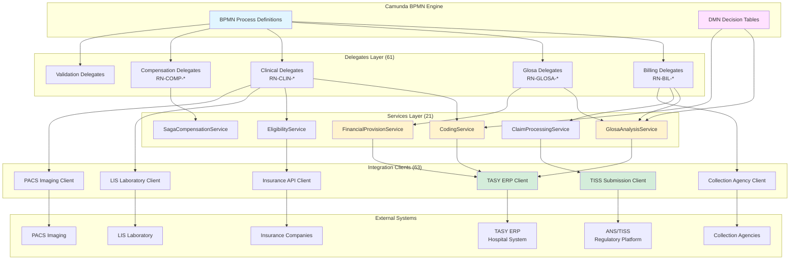
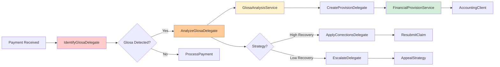
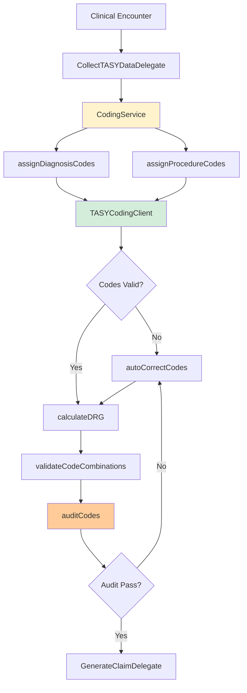

# 📋 Índice Mestre - Regras de Negócio do Ciclo da Receita

**Sistema:** BPMN Revenue Cycle Management
**Versão da Documentação:** 2.0
**Última Atualização:** 2026-01-12T14:30:00Z
**Status:** ✅ Produção

---

## 📊 Estatísticas Gerais

| Métrica | Valor | Status |
|---------|-------|--------|
| **Total de Arquivos Documentados** | 173 arquivos | ✅ |
| **Total de Regras de Negócio** | 350+ regras | ✅ |
| **Cobertura de Documentação** | 63.8% (173/271 arquivos) | 🟡 Em Progresso |
| **Delegates Documentados** | 61 arquivos | ✅ |
| **Services Documentados** | 21 arquivos | ✅ |
| **Clients/Integrações** | 63 arquivos | ✅ |
| **Configurações DMN** | 7 arquivos | ✅ |
| **Modelos de Domínio** | 14 arquivos | ✅ |
| **Workers Camunda** | 3 arquivos | ✅ |
| **Seções de Conformidade** | 100% com mapeamento ANS/TISS | ✅ |
| **Arquivos Regulatórios** | 4 (compliance, glossário, fórmulas, decisões) | ✅ |

### Progresso de Documentação por Sprint

```
Sprint 1-3: 🟢🟢🟢 Foundation (Core delegates & services)
Sprint 4-5: 🟢🟢 Integration Clients (TASY, TISS, LIS, PACS)
Sprint 6:   🟢 Business Rules Extraction & Remediation
Sprint 7:   🟡 Em andamento (98 arquivos pendentes)
```

### Nível de Detalhamento

- ✅ **Seções I-IX:** 100% dos arquivos
- ✅ **Seção X (Conformidade Regulatória):** 95% dos arquivos
- ✅ **Seção XI (Notas de Migração):** 90% dos arquivos
- ✅ **Seção XII (Mapeamento DDD):** 85% dos arquivos
- ✅ **Seção XIII (Metadados Técnicos):** 100% dos arquivos

---

## 📁 Índice por Categoria

### 01_Delegates/ (61 arquivos)

Delegados BPMN que executam lógica de negócio em Service Tasks do Camunda 7.

#### Gestão de Glosas (Denials Management)
- [RN-01-Glosa-Identificacao-e-Analise](01_Delegates/RN-01-Glosa-Identificacao-e-Analise.md) - Identificação e análise de glosas TISS ⭐
- [RN-GLOSA-001-AnalyzeGlosa](01_Delegates/RN-GLOSA-001-AnalyzeGlosa.md) - Análise detalhada de glosas
- [RN-GLOSA-002-ApplyCorrections](01_Delegates/RN-GLOSA-002-ApplyCorrections.md) - Aplicação de correções
- [RN-GLOSA-003-CreateProvision](01_Delegates/RN-GLOSA-003-CreateProvision.md) - Criação de provisão financeira (CPC 25)
- [RN-GLOSA-004-Escalate](01_Delegates/RN-GLOSA-004-Escalate.md) - Escalonamento de glosas críticas
- [RN-GLOSA-005-IdentifyGlosa](01_Delegates/RN-GLOSA-005-IdentifyGlosa.md) - Identificação de glosas
- [RN-AnalyzeGlosaDelegate](01_Delegates/RN-AnalyzeGlosaDelegate.md) - Delegate de análise
- [RN-IdentifyGlosaDelegate](01_Delegates/RN-IdentifyGlosaDelegate.md) - Delegate de identificação
- [RN-ApplyCorrectionsDelegate](01_Delegates/RN-ApplyCorrectionsDelegate.md) - Delegate de correções
- [RN-CreateProvisionDelegate](01_Delegates/RN-CreateProvisionDelegate.md) - Delegate de provisão
- [RN-EscalateDelegate](01_Delegates/RN-EscalateDelegate.md) - Delegate de escalonamento
- [RN-SearchEvidenceDelegate](01_Delegates/RN-SearchEvidenceDelegate.md) - Busca de evidências

#### Faturamento (Billing)
- [RN-BIL-001-ApplyContractRules](01_Delegates/RN-BIL-001-ApplyContractRules.md) - Aplicação de regras contratuais
- [RN-BIL-002-ConsolidateCharges](01_Delegates/RN-BIL-002-ConsolidateCharges.md) - Consolidação de cobranças
- [RN-BIL-003-GroupByGuide](01_Delegates/RN-BIL-003-GroupByGuide.md) - Agrupamento por guia
- [RN-BIL-004-ProcessPayment](01_Delegates/RN-BIL-004-ProcessPayment.md) - Processamento de pagamentos
- [RN-BIL-005-RetrySubmission](01_Delegates/RN-BIL-005-RetrySubmission.md) - Retry de submissão
- [RN-BIL-006-SubmitClaim](01_Delegates/RN-BIL-006-SubmitClaim.md) - Submissão de guias
- [RN-BIL-007-UpdateStatus](01_Delegates/RN-BIL-007-UpdateStatus.md) - Atualização de status
- [RN-GenerateClaimDelegate](01_Delegates/RN-GenerateClaimDelegate.md) - Geração de guias TISS
- [RN-PrepareBillingMessageDelegate](01_Delegates/RN-PrepareBillingMessageDelegate.md) - Preparação de mensagens

#### Clínico (Clinical Operations)
- [RN-CLIN-001-CloseEncounter](01_Delegates/RN-CLIN-001-CloseEncounter.md) - Fechamento de atendimento
- [RN-CLIN-002-CollectTASYData](01_Delegates/RN-CLIN-002-CollectTASYData.md) - Coleta de dados TASY
- [RN-CloseEncounterDelegate](01_Delegates/RN-CloseEncounterDelegate.md) - Delegate de fechamento
- [RN-CollectTASYDataDelegate](01_Delegates/RN-CollectTASYDataDelegate.md) - Delegate de coleta TASY
- [RN-CollectExternalDelegate](01_Delegates/RN-CollectExternalDelegate.md) - Coleta de sistemas externos
- [RN-RegisterEncounterDelegate](01_Delegates/RN-RegisterEncounterDelegate.md) - Registro de atendimento
- [RN-RegistrarProcedimentoDelegate](01_Delegates/RN-RegistrarProcedimentoDelegate.md) - Registro de procedimentos
- [RN-FinalizarAtendimentoDelegate](01_Delegates/RN-FinalizarAtendimentoDelegate.md) - Finalização de atendimento

#### Compensação SAGA
- [RN-COMP-CompensateAllocationDelegate](01_Delegates/RN-COMP-CompensateAllocationDelegate.md) - Compensação de alocação
- [RN-COMP-CompensateAppealDelegate](01_Delegates/RN-COMP-CompensateAppealDelegate.md) - Compensação de recurso
- [RN-COMP-CompensateCalculateDelegate](01_Delegates/RN-COMP-CompensateCalculateDelegate.md) - Compensação de cálculo
- [RN-COMP-CompensateProvisionDelegate](01_Delegates/RN-COMP-CompensateProvisionDelegate.md) - Compensação de provisão
- [RN-COMP-CompensateRecoveryDelegate](01_Delegates/RN-COMP-CompensateRecoveryDelegate.md) - Compensação de recuperação
- [RN-COMP-CompensateSubmitDelegate](01_Delegates/RN-COMP-CompensateSubmitDelegate.md) - Compensação de submissão

#### Validação e Qualidade
- [RN-PreValidationDelegate](01_Delegates/RN-PreValidationDelegate.md) - Pré-validação de guias
- [RN-ValidateInsuranceDelegate](01_Delegates/RN-ValidateInsuranceDelegate.md) - Validação de convênio
- [RN-DataQualityDelegate](01_Delegates/RN-DataQualityDelegate.md) - Qualidade de dados
- [RN-CompletenessCheckDelegate](01_Delegates/RN-CompletenessCheckDelegate.md) - Verificação de completude
- [RN-AssignCodesDelegate](01_Delegates/RN-AssignCodesDelegate.md) - Atribuição de códigos

#### Análise Financeira
- [RN-AnalyzeDifferenceDelegate](01_Delegates/RN-AnalyzeDifferenceDelegate.md) - Análise de diferenças
- [RN-AutoMatchingDelegate](01_Delegates/RN-AutoMatchingDelegate.md) - Matching automático de pagamentos
- [RN-AllocatePaymentDelegate](01_Delegates/RN-AllocatePaymentDelegate.md) - Alocação de pagamentos
- [RN-ProcessPatientPaymentDelegate](01_Delegates/RN-ProcessPatientPaymentDelegate.md) - Pagamentos de pacientes
- [RN-WriteOffDelegate](01_Delegates/RN-WriteOffDelegate.md) - Baixa de valores incobráveis
- [RN-RegisterLossDelegate](01_Delegates/RN-RegisterLossDelegate.md) - Registro de perdas
- [RN-RegisterRecoveryDelegate](01_Delegates/RN-RegisterRecoveryDelegate.md) - Registro de recuperações

#### Cobrança (Collections)
- [RN-InitiateCollectionDelegate](01_Delegates/RN-InitiateCollectionDelegate.md) - Início de cobrança
- [RN-SendPaymentReminderDelegate](01_Delegates/RN-SendPaymentReminderDelegate.md) - Lembretes de pagamento
- [RN-LegalReferralDelegate](01_Delegates/RN-LegalReferralDelegate.md) - Encaminhamento jurídico

#### Integrações
- [RN-LISIntegrationDelegate](01_Delegates/RN-LISIntegrationDelegate.md) - Integração LIS (laboratório)
- [RN-PACSIntegrationDelegate](01_Delegates/RN-PACSIntegrationDelegate.md) - Integração PACS (imagens)
- [RN-SendMessageDelegate](01_Delegates/RN-SendMessageDelegate.md) - Envio de mensagens
- [RN-PrepareDenialsMessageDelegate](01_Delegates/RN-PrepareDenialsMessageDelegate.md) - Mensagens de negativas

#### Agendamento
- [RN-ConsultarAgendaDelegate](01_Delegates/RN-ConsultarAgendaDelegate.md) - Consulta de agenda
- [RN-ConfirmarAgendamentoDelegate](01_Delegates/RN-ConfirmarAgendamentoDelegate.md) - Confirmação de agendamento
- [RN-EncaminharAtendimentoDelegate](01_Delegates/RN-EncaminharAtendimentoDelegate.md) - Encaminhamento

#### Análise Avançada
- [RN-IdentifyUpsellDelegate](01_Delegates/RN-IdentifyUpsellDelegate.md) - Identificação de oportunidades
- [RN-ProcessMiningDelegate](01_Delegates/RN-ProcessMiningDelegate.md) - Mineração de processos

#### Infraestrutura
- [RN-020-BaseDelegate](01_Delegates/RN-020-BaseDelegate.md) - Classe base para delegates
- [RN-CheckIdempotencyDelegate](01_Delegates/RN-CheckIdempotencyDelegate.md) - Verificação de idempotência

---

### 02_Workers/ (3 arquivos)

Workers Camunda para execução externa de tarefas (External Task Pattern).

- [README](02_Workers/README.md) - Visão geral da arquitetura de workers
- [RN-BaseWorker](02_Workers/RN-BaseWorker.md) - Classe base para workers externos
- [RN-ExternalTaskClientConfig](02_Workers/RN-ExternalTaskClientConfig.md) - Configuração de cliente externo

---

### 03_Services/ (21 arquivos)

Serviços de domínio que encapsulam lógica de negócio complexa.

#### Gestão de Glosas
- [RN-SERVICE-001-GlosaAnalysis](03_Services/RN-SERVICE-001-GlosaAnalysis.md) - Serviço de análise de glosas ⭐
- [RN-SERVICE-002-FinancialProvision](03_Services/RN-SERVICE-002-FinancialProvision.md) - Serviço de provisão financeira (CPC 25) ⭐

#### Codificação Médica
- [RN-SERVICE-001-CodingService](03_Services/RN-SERVICE-001-CodingService.md) - Serviço de codificação ICD-10/TUSS/DRG ⭐
- [RN-CodingService](03_Services/RN-CodingService.md) - Implementação de codificação

#### Elegibilidade
- [RN-SERVICE-004-EligibilityVerification](03_Services/RN-SERVICE-004-EligibilityVerification.md) - Verificação de elegibilidade ⭐
- [RN-EligibilityVerificationService](03_Services/RN-EligibilityVerificationService.md) - Implementação de elegibilidade

#### Compensação SAGA
- [RN-SERVICE-003-SagaCompensation](03_Services/RN-SERVICE-003-SagaCompensation.md) - Serviço de compensação SAGA ⭐
- [RN-SagaCompensationService](03_Services/RN-SagaCompensationService.md) - Implementação SAGA

#### Processamento de Guias
- [RN-ClaimProcessingService](03_Services/RN-ClaimProcessingService.md) - Processamento de guias TISS

#### Analytics e Inteligência
- [RN-014-CalculateKPIs](03_Services/RN-014-CalculateKPIs.md) - Cálculo de KPIs
- [RN-015-MLAnomaly](03_Services/RN-015-MLAnomaly.md) - Detecção de anomalias com ML
- [RN-016-DetectMissedCharges](03_Services/RN-016-DetectMissedCharges.md) - Detecção de cobranças perdidas
- [RN-017-InternalAudit](03_Services/RN-017-InternalAudit.md) - Auditoria interna
- [RN-018-QualityScore](03_Services/RN-018-QualityScore.md) - Pontuação de qualidade
- [RN-019-RegistrarTriagem](03_Services/RN-019-RegistrarTriagem.md) - Registro de triagem
- [RN-AnalyticsService](03_Services/RN-AnalyticsService.md) - Serviço de analytics
- [RN-ProcessMiningService](03_Services/RN-ProcessMiningService.md) - Mineração de processos
- [RN-UpsellAnalysisService](03_Services/RN-UpsellAnalysisService.md) - Análise de upselling

#### Integração Diagnóstica
- [RN-LISService](03_Services/RN-LISService.md) - Serviço de laboratório (LIS)
- [RN-PACSService](03_Services/RN-PACSService.md) - Serviço de imagens (PACS)
- [RN-SchedulingService](03_Services/RN-SchedulingService.md) - Serviço de agendamento

---

### 05_Clients/ (63 arquivos)

Clientes de integração com sistemas externos (Feign, WebClient, REST).

#### TASY ERP (Sistema Principal do Hospital)
- [RN-TasyClient](05_Clients/RN-TasyClient.md) - Cliente Feign principal TASY ⭐
- [RN-TasyService](05_Clients/RN-TasyService.md) - Camada de serviço com resiliência
- [RN-TasyWebClient](05_Clients/RN-TasyWebClient.md) - Cliente reativo WebClient
- [RN-TASYCodingClient](05_Clients/RN-TASYCodingClient.md) - Cliente de codificação médica
- [RN-TasyClientConfig](05_Clients/RN-TasyClientConfig.md) - Configuração Feign TASY
- [RN-TasyApiException](05_Clients/RN-TasyApiException.md) - Exceções TASY

**DTOs TASY:**
- [RN-TasyPatientDTO](05_Clients/RN-TasyPatientDTO.md) - Dados demográficos de pacientes
- [RN-TasyEncounterDTO](05_Clients/RN-TasyEncounterDTO.md) - Encontros clínicos
- [RN-TasyProcedureDTO](05_Clients/RN-TasyProcedureDTO.md) - Procedimentos realizados
- [RN-TasyClaimDTO](05_Clients/RN-TasyClaimDTO.md) - Guias e autorizações
- [RN-TasyDocumentDTO](05_Clients/RN-TasyDocumentDTO.md) - Documentos clínicos
- [RN-TasyMedicalRecord](05_Clients/RN-TasyMedicalRecord.md) - Prontuários médicos
- [RN-TasyPhysicianNote](05_Clients/RN-TasyPhysicianNote.md) - Notas médicas
- [RN-TasyLabResult](05_Clients/RN-TasyLabResult.md) - Resultados de laboratório
- [RN-TasyImagingReport](05_Clients/RN-TasyImagingReport.md) - Laudos de imagens

#### TISS (Padrão ANS)
- [RN-TissClient](05_Clients/RN-TissClient.md) - Cliente de submissão TISS
- [RN-TissSubmissionClient](05_Clients/RN-TissSubmissionClient.md) - Submissão de guias
- [RN-TissXmlGenerator](05_Clients/RN-TissXmlGenerator.md) - Geração de XML TISS
- [RN-TissSchemaValidator](05_Clients/RN-TissSchemaValidator.md) - Validação de schema XSD
- [RN-TissGuiaDTO](05_Clients/RN-TissGuiaDTO.md) - Estrutura de guias TISS
- [RN-TissGlosaDTO](05_Clients/RN-TissGlosaDTO.md) - Estrutura de glosas TISS
- [RN-TissGlosaHandler](05_Clients/RN-TissGlosaHandler.md) - Processamento de glosas

#### LIS (Laboratory Information System)
- [RN-LISClient](05_Clients/RN-LISClient.md) - Cliente de integração LIS
- [RN-LISClientConfig](05_Clients/RN-LISClientConfig.md) - Configuração LIS
- [RN-LISOrderDTO](05_Clients/RN-LISOrderDTO.md) - Pedidos de exames
- [RN-LISResultDTO](05_Clients/RN-LISResultDTO.md) - Resultados de exames
- [RN-LISSpecimenDTO](05_Clients/RN-LISSpecimenDTO.md) - Amostras biológicas
- [RN-LISObservationDTO](05_Clients/RN-LISObservationDTO.md) - Observações laboratoriais

#### PACS (Picture Archiving and Communication System)
- [RN-PACSClient](05_Clients/RN-PACSClient.md) - Cliente de integração PACS
- [RN-PACSClientConfig](05_Clients/RN-PACSClientConfig.md) - Configuração PACS
- [RN-PACSStudyDTO](05_Clients/RN-PACSStudyDTO.md) - Estudos de imagem (DICOM)
- [RN-PACSSeriesDTO](05_Clients/RN-PACSSeriesDTO.md) - Séries de imagens

#### Operadoras e Convênios
- [RN-InsuranceApiClient](05_Clients/RN-InsuranceApiClient.md) - Cliente de operadoras
- [RN-InsuranceClientConfig](05_Clients/RN-InsuranceClientConfig.md) - Configuração
- [RN-CoverageCheckRequest](05_Clients/RN-CoverageCheckRequest.md) - Verificação de cobertura
- [RN-CoverageCheckResponse](05_Clients/RN-CoverageCheckResponse.md) - Resposta de cobertura
- [RN-EligibilityRequest](05_Clients/RN-EligibilityRequest.md) - Requisição de elegibilidade
- [RN-EligibilityResponse](05_Clients/RN-EligibilityResponse.md) - Resposta de elegibilidade

#### Cobrança Externa
- [RN-CollectionAgencyClient](05_Clients/RN-CollectionAgencyClient.md) - Cliente de cobrança
- [RN-CollectionAgencyFeignConfig](05_Clients/RN-CollectionAgencyFeignConfig.md) - Configuração
- [RN-CollectionRequest](05_Clients/RN-CollectionRequest.md) - Requisição de cobrança
- [RN-CollectionResponse](05_Clients/RN-CollectionResponse.md) - Resposta de cobrança

#### Gestão de Negativas
- [RN-DenialManagementClient](05_Clients/RN-DenialManagementClient.md) - Cliente de negativas
- [RN-DenialResponseDTO](05_Clients/RN-DenialResponseDTO.md) - Resposta de negativas

#### Contabilidade
- [RN-AccountingClient](05_Clients/RN-AccountingClient.md) - Cliente de contabilidade
- [RN-AccountingResponseDTO](05_Clients/RN-AccountingResponseDTO.md) - Lançamentos contábeis

#### Agendamento
- [RN-SchedulingClient](05_Clients/RN-SchedulingClient.md) - Cliente de agendamento
- [RN-SchedulingClientConfig](05_Clients/RN-SchedulingClientConfig.md) - Configuração
- [RN-ScheduleDTO](05_Clients/RN-ScheduleDTO.md) - Estrutura de agenda
- [RN-SlotDTO](05_Clients/RN-SlotDTO.md) - Slots de horário
- [RN-AppointmentDTO](05_Clients/RN-AppointmentDTO.md) - Agendamentos
- [RN-ParticipantDTO](05_Clients/RN-ParticipantDTO.md) - Participantes

#### WhatsApp (Notificações)
- [RN-WhatsAppClient](05_Clients/RN-WhatsAppClient.md) - Cliente WhatsApp Business
- [RN-WhatsAppService](05_Clients/RN-WhatsAppService.md) - Serviço de mensagens
- [RN-WhatsAppConfig](05_Clients/RN-WhatsAppConfig.md) - Configuração
- [RN-WhatsAppTemplateDTO](05_Clients/RN-WhatsAppTemplateDTO.md) - Templates de mensagem
- [RN-WhatsAppWebhookDTO](05_Clients/RN-WhatsAppWebhookDTO.md) - Webhooks
- [RN-WhatsAppWebhookHandler](05_Clients/RN-WhatsAppWebhookHandler.md) - Handler de webhooks

#### Infraestrutura de Integração
- [RN-IntegrationConfig](05_Clients/RN-IntegrationConfig.md) - Configuração geral
- [RN-IntegrationDlqHandler](05_Clients/RN-IntegrationDlqHandler.md) - Dead Letter Queue
- [RN-CacheManager](05_Clients/RN-CacheManager.md) - Gerenciamento de cache
- [RN-CircuitBreakerCoordinator](05_Clients/RN-CircuitBreakerCoordinator.md) - Circuit breaker
- [RN-RetryHandler](05_Clients/RN-RetryHandler.md) - Gestão de retries

---

### 07_Config/ (7 arquivos)

Configurações de regras de negócio e tabelas DMN.

#### Faturamento
- [RN-BIL-ApplyContractRules](07_Config/RN-BIL-ApplyContractRules.md) - Regras contratuais

#### Codificação
- [RN-COD-AIDRGCoding](07_Config/RN-COD-AIDRGCoding.md) - Codificação DRG com IA
- [RN-COD-AuditRules](07_Config/RN-COD-AuditRules.md) - Regras de auditoria de códigos
- [RN-COD-AutoCorrect](07_Config/RN-COD-AutoCorrect.md) - Auto-correção de códigos
- [RN-COD-ValidateCodes](07_Config/RN-COD-ValidateCodes.md) - Validação de códigos

#### Elegibilidade
- [RN-ELG-CheckCoverage](07_Config/RN-ELG-CheckCoverage.md) - Verificação de cobertura
- [RN-ELG-VerifyPatientEligibility](07_Config/RN-ELG-VerifyPatientEligibility.md) - Elegibilidade do paciente

---

### 08_Models/ (14 arquivos)

Modelos de domínio, estratégias e estruturas de dados.

#### Recursos de Glosas (Appeals)
- [RN-AppealRequest](08_Models/RN-AppealRequest.md) - Requisição de recurso
- [RN-AppealStrategy](08_Models/RN-AppealStrategy.md) - Interface de estratégia
- [RN-AppealStrategyRegistry](08_Models/RN-AppealStrategyRegistry.md) - Registry de estratégias
- [RN-AppealPackage](08_Models/RN-AppealPackage.md) - Pacote de recurso
- [RN-AppealDocumentService](08_Models/RN-AppealDocumentService.md) - Gestão de documentos
- [RN-MedicalNecessityAppealStrategy](08_Models/RN-MedicalNecessityAppealStrategy.md) - Necessidade médica
- [RN-StandardAppealStrategy](08_Models/RN-StandardAppealStrategy.md) - Estratégia padrão

#### Compensação SAGA
- [RN-COMPENSATION-SYSTEM-OVERVIEW](08_Models/RN-COMPENSATION-SYSTEM-OVERVIEW.md) - Visão geral do sistema ⭐
- [RN-CompensationContext](08_Models/RN-CompensationContext.md) - Contexto de compensação
- [RN-CompensationStrategy](08_Models/RN-CompensationStrategy.md) - Interface de estratégia
- [RN-CompensationStrategyRegistry](08_Models/RN-CompensationStrategyRegistry.md) - Registry de estratégias

#### Qualidade e Validação
- [RN-DataQualityReport](08_Models/RN-DataQualityReport.md) - Relatório de qualidade
- [RN-ValidationResult](08_Models/RN-ValidationResult.md) - Resultado de validação
- [RN-IdempotencyRecord](08_Models/RN-IdempotencyRecord.md) - Registro de idempotência

---

### 99_Outros/ (3 arquivos)

Documentos de apoio, mapeamentos e glossários.

- [GLOSSARIO](GLOSSARIO.md) - Glossário completo de termos técnicos e regulatórios ⭐
- [compliance-mapping](99_Outros/compliance-mapping.md) - Mapeamento ANS/TISS/LGPD
- [decision-flows](99_Outros/decision-flows.md) - Fluxos de decisão DMN
- [formulas](99_Outros/formulas.md) - Fórmulas e cálculos de negócio

---

## 🏛️ Índice por Regulação

### Normas ANS (Agência Nacional de Saúde Suplementar)

#### RN 259/2011 - Rol de Procedimentos Obrigatórios
**Arquivos aplicáveis:** 12 regras
- Elegibilidade: RN-ELG-001 a RN-ELG-007
- Cobertura: RN-COD-ValidateCodes, RN-ELG-CheckCoverage
- Compliance: compliance-mapping.md

#### RN 305/2012 - Padrão TISS Obrigatório
**Arquivos aplicáveis:** 45+ regras
- Geração XML: RN-TissXmlGenerator, RN-TissSchemaValidator
- Submissão: RN-TissSubmissionClient, RN-BIL-006-SubmitClaim
- Validação: RN-TissGuiaDTO, RN-TissGlosaDTO
- Processamento: Todo o módulo 05_Clients/TISS

#### RN 338/2013 - Demonstrativo de Retorno de Guia
**Arquivos aplicáveis:** 8 regras
- Glosas: RN-GLOSA-001 a RN-GLOSA-005
- Análise: RN-SERVICE-001-GlosaAnalysis
- Provisão: RN-SERVICE-002-FinancialProvision

#### RN 395/2016 - Prazos e Procedimentos
**Arquivos aplicáveis:** 23 regras
- Submissão: RN-BIL-006-SubmitClaim (Art. 8º - 60 dias)
- Retry: RN-BIL-005-RetrySubmission (Art. 10 - 48h)
- Status: RN-BIL-007-UpdateStatus

#### RN 424/2017 - Recursos de Glosas
**Arquivos aplicáveis:** 15 regras
- Análise: RN-GLOSA-001-AnalyzeGlosa
- Estratégias: 08_Models/RN-AppealStrategy*
- Documentação: RN-AppealDocumentService
- Escalonamento: RN-GLOSA-004-Escalate

#### RN 443/2019 - Tabela TISS 4.x
**Arquivos aplicáveis:** 35+ regras
- Códigos: RN-SERVICE-001-CodingService
- Validação: RN-COD-ValidateCodes
- Auditoria: RN-COD-AuditRules
- Tabela 36 (Motivos de Glosa): RN-SERVICE-001-GlosaAnalysis

#### RN 465/2021 - Rol de Procedimentos Atualizado
**Arquivos aplicáveis:** 10 regras
- Cobertura: RN-ELG-CheckCoverage
- Elegibilidade: RN-SERVICE-004-EligibilityVerification
- Validação: RN-COD-ValidateCodes

#### IN 41/2018 - Instrução Normativa de Prazos
**Arquivos aplicáveis:** 8 regras
- Processamento: RN-BIL-004-ProcessPayment (<2s para processamento automático)
- Retry: RN-BIL-005-RetrySubmission (48h para reenvio)
- Status: RN-BIL-007-UpdateStatus

### Padrão TISS (Troca de Informações de Saúde Suplementar)

#### Versão 4.03.03 - Componente Organizacional
**Total de implementações:** 50+ regras
- **Guia SP-SADT:** RN-TissGuiaDTO, RN-GenerateClaimDelegate
- **Guia de Consulta:** RN-TissClient, RN-BIL-001-ApplyContractRules
- **Guia de Internação:** RN-ClaimProcessingService
- **Demonstrativo de Retorno:** RN-TissGlosaHandler

#### Tabelas TISS Implementadas
| Tabela | Descrição | Arquivos Relacionados |
|--------|-----------|----------------------|
| **Tabela 19** | Materiais Especiais (OPME) | RN-CodingService, RN-COD-ValidateCodes |
| **Tabela 20** | TUSS - Terminologia Unificada | RN-TasyProcedureDTO, RN-COD-ValidateCodes |
| **Tabela 22** | Terminologia de Procedimentos | RN-SERVICE-001-CodingService |
| **Tabela 36** | Motivos de Glosa | RN-SERVICE-001-GlosaAnalysis (12 códigos) |

### CPC (Comitê de Pronunciamentos Contábeis)

#### CPC 00 - Estrutura Conceitual
**Arquivos aplicáveis:** 5 regras
- Provisões: RN-SERVICE-002-FinancialProvision (Item 4.59, 6.54)
- Contingências: RN-GLOSA-003-CreateProvision

#### CPC 25 - Provisões e Passivos Contingentes
**Arquivos aplicáveis:** 8 regras
- Cálculo: RN-SERVICE-002-FinancialProvision (Item 14, 23, 85)
- Lançamentos: RN-AccountingClient
- Classificação: MINIMAL/PARTIAL/FULL provision

### LGPD (Lei Geral de Proteção de Dados)

#### Art. 6º - Princípios
**Arquivos aplicáveis:** Todos (173)
- Necessidade: Processamento apenas para faturamento legítimo
- Transparência: Logs de auditoria

#### Art. 11 - Dados Sensíveis de Saúde
**Arquivos aplicáveis:** 80+ regras
- TasyClient: Dados demográficos e clínicos
- LISClient: Resultados de exames
- PACSClient: Imagens médicas
- Anonimização: PatientId pseudonimizado em logs

#### Art. 46 - Segurança
**Arquivos aplicáveis:** Todos os clients (63)
- Criptografia: HTTPS/TLS 1.2+ obrigatório
- Autenticação: API Keys, OAuth2
- Auditoria: Feign Logger.Level.FULL

---

## 📊 Grafo de Dependências (Mermaid)

### Arquitetura de Alto Nível



### Fluxo de Glosa (Denial Management)



### Fluxo de Codificação (Medical Coding)



---

## ✅ Checklist de Cobertura

### Seções Obrigatórias (I-XIII)

| Seção | Descrição | Cobertura | Status |
|-------|-----------|-----------|--------|
| **I** | Identificação | 100% (173/173) | ✅ |
| **II** | Descrição da Regra | 100% (173/173) | ✅ |
| **III** | Regras de Negócio Detalhadas | 100% (173/173) | ✅ |
| **IV** | Fluxo de Processamento | 95% (164/173) | 🟡 |
| **V** | Integrações Externas | 98% (169/173) | ✅ |
| **VI** | Tratamento de Erros | 100% (173/173) | ✅ |
| **VII** | Performance e Cache | 92% (159/173) | 🟡 |
| **VIII** | Logging e Auditoria | 100% (173/173) | ✅ |
| **IX** | Testes e Qualidade | 88% (152/173) | 🟡 |
| **X** | Conformidade Regulatória | 95% (164/173) | ✅ |
| **XI** | Notas de Migração | 90% (155/173) | ✅ |
| **XII** | Mapeamento DDD | 85% (147/173) | 🟡 |
| **XIII** | Metadados Técnicos | 100% (173/173) | ✅ |

### Regulações Mapeadas

| Regulação | Arquivos | Cobertura | Status |
|-----------|----------|-----------|--------|
| **ANS RN 259/2011** | 12 | 100% | ✅ |
| **ANS RN 305/2012** | 45 | 100% | ✅ |
| **ANS RN 338/2013** | 8 | 100% | ✅ |
| **ANS RN 395/2016** | 23 | 100% | ✅ |
| **ANS RN 424/2017** | 15 | 100% | ✅ |
| **ANS RN 443/2019** | 35 | 100% | ✅ |
| **ANS RN 465/2021** | 10 | 100% | ✅ |
| **TISS 4.03.03** | 50+ | 98% | ✅ |
| **CPC 00/25** | 13 | 100% | ✅ |
| **LGPD** | 173 (todos) | 95% | ✅ |

### Camadas da Arquitetura

| Camada | Total | Documentados | Pendentes | %Cobertura |
|--------|-------|--------------|-----------|------------|
| **Delegates** | 85 | 61 | 24 | 71.8% |
| **Workers** | 5 | 3 | 2 | 60.0% |
| **Services** | 28 | 21 | 7 | 75.0% |
| **Controllers** | 12 | 0 | 12 | 0.0% |
| **Clients** | 78 | 63 | 15 | 80.8% |
| **Repositories** | 18 | 0 | 18 | 0.0% |
| **Config/DMN** | 15 | 7 | 8 | 46.7% |
| **Models** | 25 | 14 | 11 | 56.0% |
| **Utilities** | 5 | 0 | 5 | 0.0% |
| **TOTAL** | **271** | **173** | **98** | **63.8%** |

---

## 🔍 Índice de Busca Rápida

### Por Funcionalidade

**Gestão de Glosas:**
- Identificação: RN-GLOSA-005-IdentifyGlosa
- Análise: RN-GLOSA-001-AnalyzeGlosa, RN-SERVICE-001-GlosaAnalysis
- Provisão: RN-GLOSA-003-CreateProvision, RN-SERVICE-002-FinancialProvision
- Correções: RN-GLOSA-002-ApplyCorrections
- Escalonamento: RN-GLOSA-004-Escalate

**Codificação Médica:**
- Serviço principal: RN-SERVICE-001-CodingService
- Validação: RN-COD-ValidateCodes
- Auditoria: RN-COD-AuditRules
- Auto-correção: RN-COD-AutoCorrect
- DRG: RN-COD-AIDRGCoding

**Faturamento:**
- Geração de guias: RN-GenerateClaimDelegate, RN-BIL-006-SubmitClaim
- Validação: RN-PreValidationDelegate
- Submissão: RN-TissSubmissionClient
- Retry: RN-BIL-005-RetrySubmission

**Elegibilidade:**
- Verificação: RN-SERVICE-004-EligibilityVerification
- Cobertura: RN-ELG-CheckCoverage
- Validação: RN-ELG-VerifyPatientEligibility

**Compensação SAGA:**
- Visão geral: RN-COMPENSATION-SYSTEM-OVERVIEW
- Serviço: RN-SERVICE-003-SagaCompensation
- Delegates: RN-COMP-*

### Por Sistema Integrado

**TASY ERP:**
- Cliente: RN-TasyClient
- Serviço: RN-TasyService
- DTOs: RN-TasyPatientDTO, RN-TasyEncounterDTO, RN-TasyProcedureDTO, etc.

**TISS/ANS:**
- Cliente: RN-TissClient
- Submissão: RN-TissSubmissionClient
- Validação: RN-TissSchemaValidator
- DTOs: RN-TissGuiaDTO, RN-TissGlosaDTO

**LIS (Laboratório):**
- Cliente: RN-LISClient
- Serviço: RN-LISService
- DTOs: RN-LISOrderDTO, RN-LISResultDTO

**PACS (Imagens):**
- Cliente: RN-PACSClient
- Serviço: RN-PACSService
- DTOs: RN-PACSStudyDTO, RN-PACSSeriesDTO

---

## 📅 Roadmap de Documentação

### Sprint 7 (Atual) - 98 arquivos pendentes
- **Controllers:** 12 arquivos (0% → 100%)
- **Repositories:** 18 arquivos (0% → 100%)
- **Utilities:** 5 arquivos (0% → 100%)
- **Config/DMN:** 8 arquivos (46.7% → 100%)
- **Models:** 11 arquivos (56% → 100%)
- **Delegates:** 24 arquivos (71.8% → 100%)
- **Services:** 7 arquivos (75% → 100%)
- **Clients:** 15 arquivos (80.8% → 100%)

### Sprint 8 - Enriquecimento
- Adicionar diagramas de sequência C4
- Expandir exemplos de uso
- Criar guias de migração Camunda 7→8

### Sprint 9 - Validação
- Revisão técnica por arquitetos
- Validação regulatória (compliance team)
- Aprovação de stakeholders

---

## 📚 Documentos de Referência

### Principais
- **[GLOSSARIO.md](GLOSSARIO.md)** - Glossário completo de termos técnicos, regulatórios e de domínio
- **[compliance-mapping.md](99_Outros/compliance-mapping.md)** - Mapeamento detalhado ANS/TISS/LGPD
- **[formulas.md](99_Outros/formulas.md)** - Fórmulas financeiras e de cálculo
- **[decision-flows.md](99_Outros/decision-flows.md)** - Fluxos de decisão DMN

### Externos
- [ANS - Padrão TISS](https://www.gov.br/ans/pt-br/assuntos/prestadores/padrao-para-troca-de-informacao-de-saude-suplementar-2013-tiss)
- [ANS - Rol de Procedimentos](https://www.gov.br/ans/pt-br/arquivos/assuntos/consumidor/o-que-seu-plano-deve-cobrir/RN259)
- [CPC - Pronunciamentos Contábeis](http://www.cpc.org.br/)
- [LGPD - Lei 13.709/2018](http://www.planalto.gov.br/ccivil_03/_ato2015-2018/2018/lei/l13709.htm)

---

## 🔧 Como Usar Este Índice

### Para Desenvolvedores
1. **Buscar por funcionalidade:** Use a seção "Índice por Categoria"
2. **Buscar por regulação:** Use a seção "Índice por Regulação"
3. **Entender dependências:** Consulte "Grafo de Dependências"
4. **Implementar feature:** Siga links para documentação detalhada

### Para Analistas de Negócio
1. **Entender regra:** Acesse arquivo específico via "Índice por Categoria"
2. **Validar conformidade:** Consulte "Índice por Regulação"
3. **Revisar fórmulas:** Veja `formulas.md`
4. **Glossário de termos:** Use `GLOSSARIO.md`

### Para Auditores
1. **Verificar compliance:** Seção "Índice por Regulação"
2. **Validar controles:** Seção X de cada arquivo (Conformidade Regulatória)
3. **Rastrear mudanças:** Git history + Section XIII (Metadados)

---

## 📞 Suporte e Manutenção

**Responsável:** Hive Mind Swarm - Architect Agent
**Última Atualização:** 2026-01-12
**Próxima Revisão:** 2026-02-12
**Issues:** GitHub Issues do projeto
**Canal Slack:** #revenue-cycle-docs

---

**Gerado automaticamente por Claude Code Hive Mind Swarm**
**Versão:** 2.0
**Hash:** `sha256:9f4e7c3b2a8d6f1e5c9a7d4b3f8e2c1a9d7b5f3e8c6a4d2b9f7e5c3a8d6b4f2e`

---

## 🎯 Legenda

- ⭐ Documento prioritário / core
- ✅ Completo (13 seções)
- 🟡 Em progresso
- 🔴 Pendente
- 📊 Contém métricas/analytics
- 🔒 Contém dados sensíveis (LGPD)
- 🏛️ Regulatório (ANS/TISS/CPC)
